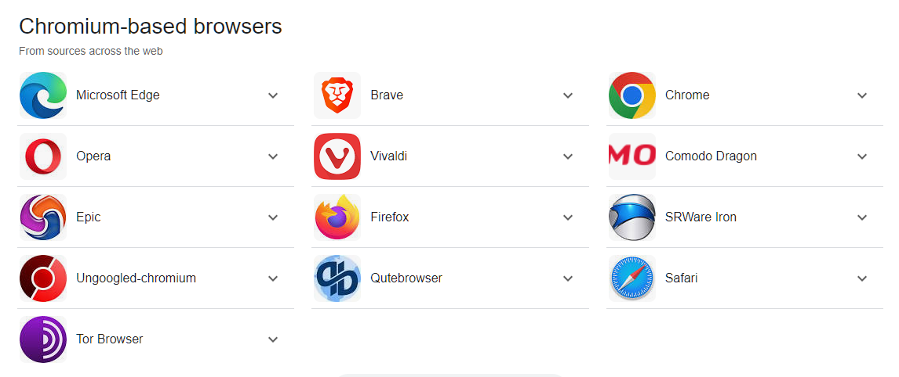
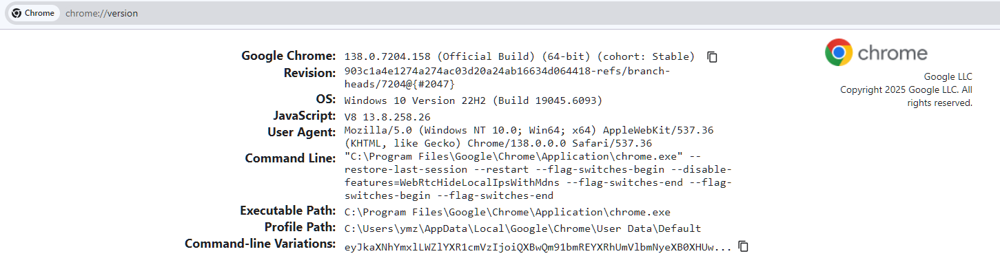

# EdgeOps Abro


**A**utomation **B**rowser (aka Abro) enable end-users to create automation based on their web browsing experience

**TLDR:** your browsing activity is yours and you should be able to access it, manipulate it or do whatever you do with it (probably, by using an autonation to assist you control the jigh data lodas your activity produces)

## Supported Browsers

Basically, any modern which is built on-top of [chromium](https://www.chromium.org/Home/) is supported. For your convenience, here's a dump from google search



## One Minute Setup

Let's see what this project can do first! To simplify as much as possible, please use chrome browser (for the first time at least) in order to see `Abro` in action as fast as possible

* Copy files to your local machine
  * via git (use terminal to execute) - `git clone https://github.com/edgeopspro/abro.git`
  * manual download:
    * from github interface - click the `Code` button and select `Download ZIP`
    * extract downloaded file content into a folder (aka workdir)
* Install `Node.JS` on your local machine (if not already installed), using the [download page](https://nodejs.org/en/download)
* Open your browser, and navigate to [chrome://version](chrome://version)
* Copy the `Executable Path` value and save it (for the next step)
* Open the `config.json` file and replace the `executablePath` property value with your machine value
* Open a terminal window, enter your workdir perform the following commands:
  * `cd core` - enter the `core` folder
  * `npm start config.json` - start a browser with a RTR demo



```json
{
  "browser": {
    "executablePath": "YOUR_EXEC_PATH_GOES_HERE",
    "headless": false,
    "waitUntil": "domcontentloaded",
    "devtools": false,
    "dumpio": true,
    "defaultViewport": null,
    "args": [
      "--start-maximized",
      "--no-sandbox",
      "--disable-gpu",
      "--no-first-run",
      "--no-zygote",
      "--no-omnibox-search-button"
    ]
  },
  "controller": "ctrl.demo.js",
  "homepage": "http://localhost:404"
}
```

That's pertty much it! A new browser window will appear with the invalid url [http://localhost:404]([http://localhost:404). This is fine (can be changed via editing `config.json` file). You may notice that even this navigation try has already produced a detailed data, reflecting your navigation. Just continue browsing and observe as the log in your terminal window grows

## What Should I Do With It?

Well, pretty much whatever you want / need. This is achance to gain control over **your data** without relaying on suspicious 3rd-party extensions, proxies, VPNs, etc. You can save it, query it and get meaninful insights over your iverall browsing experience

## What's Next?

The demo, represented by `ctrl.demo.js` is only the tip of the iceberg. You can create your own controller (don't forget to modify `controller` property inside `config.json` file) and try it yourself

## Proper Deployment

So, let's assume we finished development and want to use `Abro` as an executable (like noraml people). So:

```bash
npm run build
```

Should download and compile multiple executables (one of them shoukd much your OS) as well as create a copy of your `config` and `controller` files. Running the executable is very similart to the development run: specify your config gile and you are good to go. *For instance:* for windows users , open the terminal, navgate to your working dir and type the following commands

```bash
cd bin/gen
./abro-win config.json
```

Note that the destination folder (`bin/gen`) can be modified by editing the `outputPath` property inside the `package.json` file (under the `pkg` section)